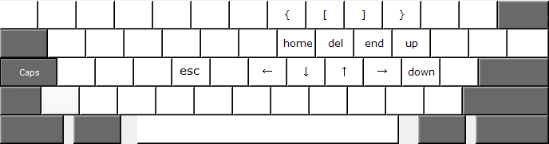

ahk
===

Small script for AutoHotKey, adding more useful functionality to Capslock.

- caps.exe  contains a standalone version of the script which can be used when AutoHotKey is not installed. It will probably only work on 64-bit systems.
- caps.ahk  contains the actual script

[License](LICENSE)