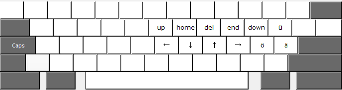

# keyboard

This repository contains my keyboard setup for Linux and Windows. The idea is to make Capslock act as an additional modifier in order to map frequently used keys to the home row.

## Usage

Downloaded the [latest release](https://github.com/schmittl/keyboard/releases/latest)

### Linux 

Install the xkb files.

### Windows

Run `setup.exe` to install the custom keyboard layout.
Run `create_startup_shortcut.bat` to install a shortcut in the startup folder that runs the AutoHotKey script.

## How it works

### Linux

Under Linux using XKB seems to work best across different DEs. Configuration via .Xmodmap is also possible, but deprecated.

### Windows

Under Windows two different components are used:

[ahk/](windows/ahk/) Script for AutoHotKey to let Capslock act as an additional modifier.
[us-ger/](windows/us-ger/) Customized US keyboard layout. Requires MSKLC to build the layout.

The us-ger keyboard layout is used to provide a reliable remapping of the z and y keys in some applications and to add a few additional keys via the AltGr modifier to the default US layout.

### Packaging notes

Create keyboard layout installation files via MSKLC `Project -> Build DLL and Setup Package`.
Compile caps.ahk into `.exe`. The resulting `.exe` does not require AHK to be installed on the system.

## License

Files are released under the unlicense. See [LICENSE](LICENSE) or http://unlicense.org/
